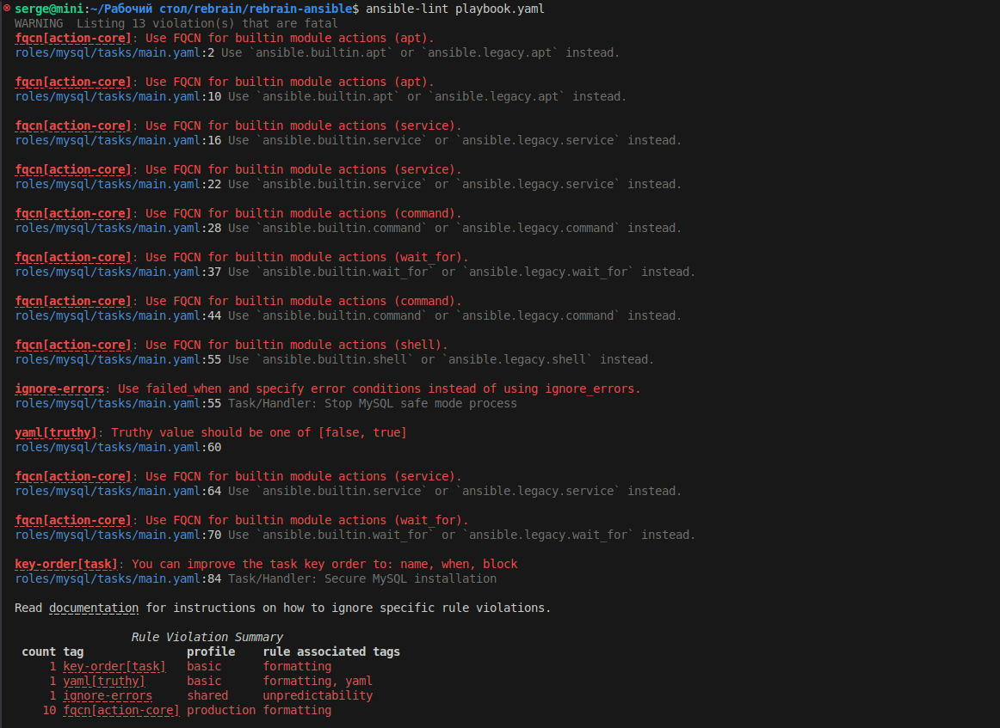
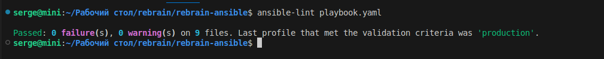
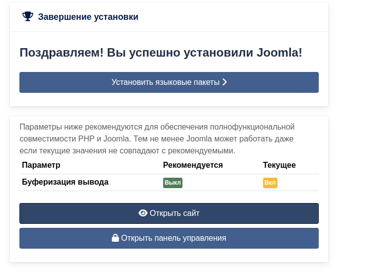

<h2 align="center">Ansible LEMP Stack с Joomla CMS</h2>

Этот Ansible проект автоматизирует развертывание LEMP-стека (Linux, Nginx, MySQL, PHP) с CMS Joomla на серверах Ubuntu.

[TOC]

## Требования

- Ansible 2.9+
- Сервер Ubuntu 20.04/22.04
- Доступ по SSH к целевому серверу с правами sudo
- Python 3.x на целевом сервере

## Установка

1. Клонируйте репозиторий:

   ```
   git clone https://github.com/Perovss/rebrain-ansible.git
   cd rebrain-ansible
   ```

2. Настройте инвентарь:

   - Отредактируйте `inventory.yml` с данными вашего сервера
   - Убедитесь, что ваш SSH-ключ настроен для аутентификации

3. Настройте переменные:

   - Отредактируйте `group_vars/all/vars.yml` для базовой конфигурации

   - Для чувствительных данных отредактируйте vault-файл:

     ```
     ansible-vault edit group_vars/all/vault.yml
     ```

     Установите эти переменные:

     ```
     vault_mysql_root_password: "ваш_root_пароль_mysql"
     vault_mysql_user_password: "ваш_пароль_пользователя_mysql"
     ```

   

## Развертывание

Запустите плейбук:

```
ansible-playbook playbook.yml --ask-vault-pass
```

Вам будет предложено ввести vault-пароль, который вы установили при шифровании vault-файла.

## Настройка после установки

После успешного развертывания:

1. Откройте IP-адрес сервера в веб-браузере
2. Завершите установку Joomla через веб-интерфейс:
   - Название сайта: Укажите имя вашего сайта
   - Учетные данные суперпользователя: Установите имя пользователя/пароль администратора
   - Конфигурация базы данных:
     - Тип базы данных: MySQLi
     - Имя хоста: localhost
     - Имя пользователя: admin (или ваш настроенный пользователь MySQL)
     - Пароль: [используйте пароль пользователя MySQL из vault]
     - Имя базы данных: joomla_db
     - Префикс таблиц: jml_ (или оставьте по умолчанию)
3. Удалите папку installation, когда будет предложено

## Детали конфигурации

### Настройки по умолчанию

- Корневая директория сайта: `/var/www/sites/joomla`
- Конфиг Nginx: `/etc/nginx/sites-available/joomla.conf`
- Версия PHP: 8.1
- MySQL:
  - Пароль root: Установлен в vault
  - Пользователь приложения: admin (пароль установлен в vault)
  - Имя базы данных: joomla_db

### Версия Joomla

Плейбук по умолчанию устанавливает Joomla {{ joomla_version }}. Для изменения:

1. Отредактируйте `roles/group_vars/all/main.yml`
2. Обновите номер версии
3. Перезапустите плейбук

## Примечания по безопасности

1. После установки:
   - Настройте SSL/TLS для Nginx
   - Настройте брандмауэр (ufw)
   - Рассмотрите возможность изменения стандартных портов MySQL
   - Настройте регулярное резервное копирование
2. Зашифрованные vault-пароли защищены только настолько, насколько надежен ваш vault-пароль. Регулярно меняйте пароли.

## Проверка ansible-lint



После исправления ошибок




## Проверка создания сайта

